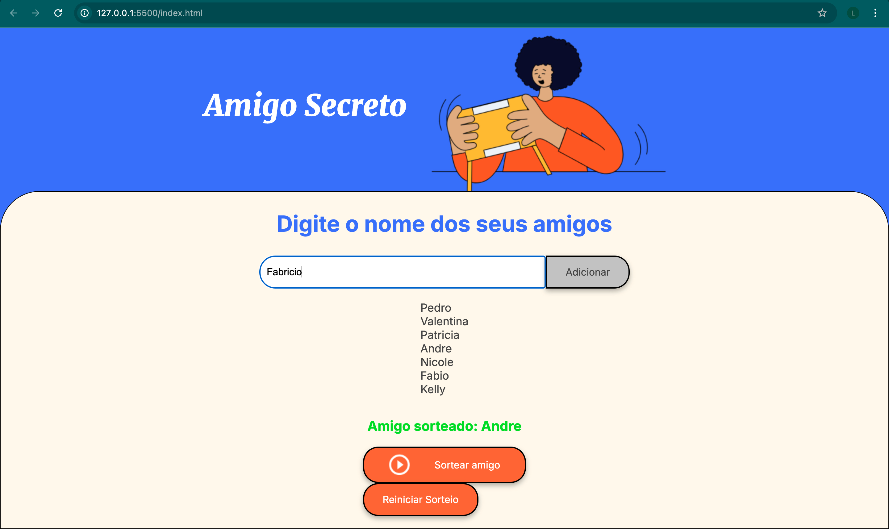

# Sorteio de Amigo Secreto 🎁

Um aplicativo simples, elegante e funcional para realizar sorteios de **Amigo Secreto** de forma prática e divertida! ✨

## 📜 Descrição

Este projeto foi desenvolvido utilizando **HTML**, **CSS** e **JavaScript**, com o objetivo de facilitar a organização de sorteios de amigo secreto. Com uma interface intuitiva, você pode adicionar nomes de participantes e realizar o sorteio de forma totalmente aleatória.

## ⚙️ Funcionalidades

- **Adicionar Participantes**: Insira os nomes no campo de texto e clique no botão "Adicionar" para armazená-los.
- **Lista de Participantes**: Visualize os nomes dos participantes adicionados.
- **Sorteio Aleatório**: Com apenas um clique no botão "Sortear amigo", um nome é escolhido aleatoriamente.
- **Design Responsivo**: Interface adaptada para diferentes dispositivos, proporcionando uma experiência fluida em desktops, tablets e celulares.

## 🎯 Objetivo

O aplicativo foi criado para simplificar o processo de sorteios de amigo secreto, ideal para festas, reuniões de família, ou eventos entre amigos.

## 🛠️ Tecnologias Utilizadas

- **HTML**: Estrutura da aplicação.
- **CSS**: Estilo e layout responsivo.
- **JavaScript**: Lógica para adicionar nomes e realizar o sorteio aleatório.

## 🚀 Como Utilizar

1. Clone este repositório:
   ```bash
   git clone git@github.com:brodyandre/Sorteio-amigo-secreto.git

2. Abra o arquivo index.html no navegador.
3. Adicione os nomes no campo de texto e clique em "Adicionar".
4. Quando todos os nomes forem adicionados, clique em "Sortear amigo" e divirta-se! 🎉

   
5. 📷 Capturas de Tela

Aqui está uma prévia do aplicativo em funcionamento:



6. 🙋 Sobre o Autor


Luiz André
Desenvolvedor entusiasta, apaixonado por criar soluções simples e eficientes. Conecte-se comigo em GitHub!

 ### Meu Projeto

Esse é o meu aplicativo que foi deployado no Vercel.

Acesse a aplicação ao vivo: [https://meuapp.vercel.app](https://sorteio-amigo-secreto-48zkm4cml-luiz-andre-de-souzas-projects.vercel.app)


